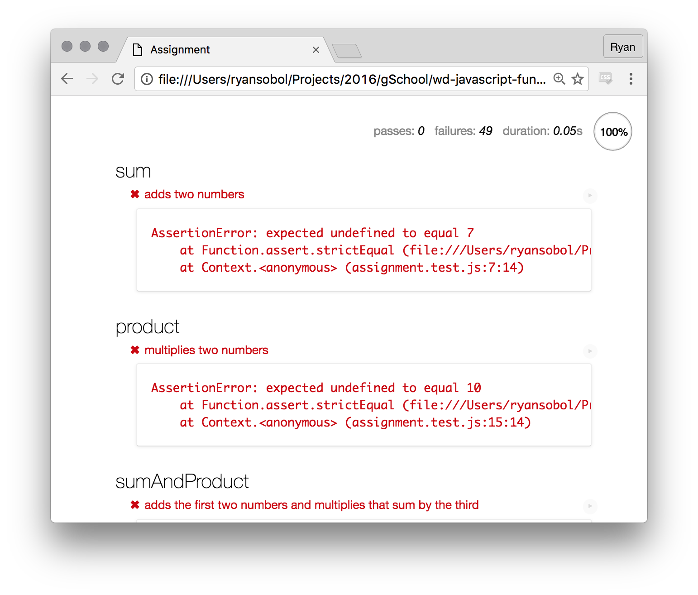
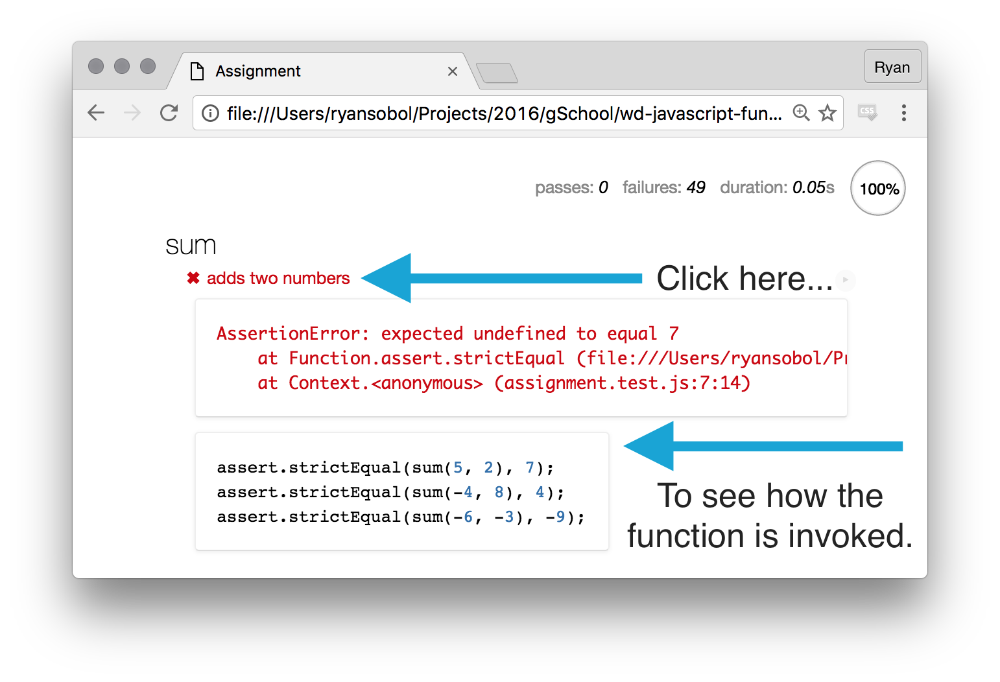
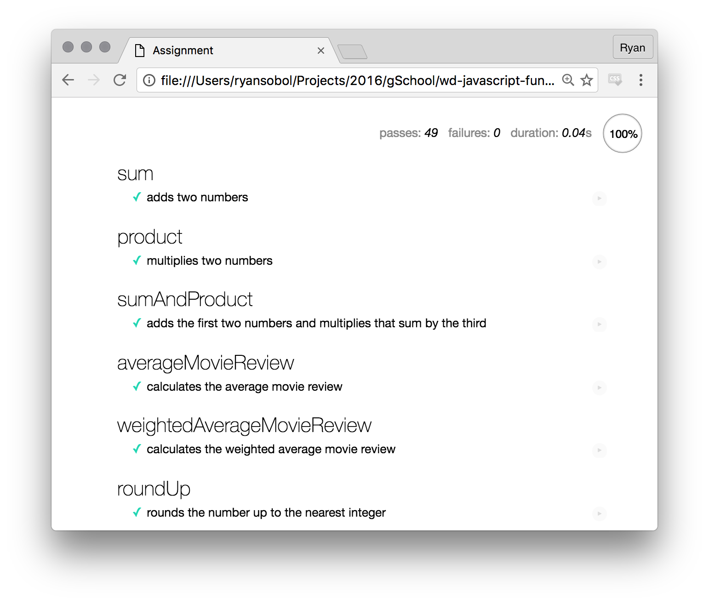

## JavaScript Functions

These exercises all have to do with the following standard:

Related Standard: <a href="#">(W0003)</a> - Organize code with functions

Some relate to other standards, such as:

* <a href="#">(W0099)</a> - Use conditionals and loops to control the flow of a program

### [Functions using Expressions](./part1)

Wrestle with the following concepts:
- Primitives
- Functions
- Declarations
- Globals
- Operators
- Control flow

### [Functions with Arrays & Objects](./part2)

- Functions (again)
- Arrays
- Objects
- Iterations

Each part has two components — an **assignment** and a **bonus**. Complete the each part's assignment before moving on to its respective bonus or the next part's assignment.

**TIP:** You're encouraged to use online documentation to lookup how to use unfamiliar concepts.

### Setup

To get started, download this code onto your machine by following these setup instructions.

1. If you haven't already, fork the `javascript-drills` repository to your own GitHub account.
1. Clone your forked repository to your development environment.
1. Open the repository's project directory in your text editor.
1. Type `open index.html` from this folder in your terminal to view your progress on each part of this section.

In your web browser, you'll see a page that shows a bunch of failing JavaScript tests. Locate the area that shows how many tests are passing and how many are failing.

### How to proceed

Your job is to make all these JavaScript tests pass by completing their respective puzzle.

1. Open the `part1/assignment.js` file in your text editor.
1. Read the instructions for the puzzle.
1. Solve the puzzle by writing JavaScript.

Once it's ready, test your solution.

1. Tab over to the browser with `Command + Tab`.
1. Refresh the browser with `Command + R`.
1. Scroll to the puzzle's test and see if it's still red.
1. Once the test is green, you've solved the puzzle.
1. Commit your work _every time_ you solve a puzzle.

You can see how each test invokes the puzzle's function by clicking on the test description.

### Wrestle with it

You may encounter challenges that seem confusing or impossible. Don't despair! This exercise is designed to challenge you. Resist the urge to just copy-and-paste code from your classmates, but definitely ask for help and talk to your peers.

When you're done with the main assignment, your page should look like this. Green check marks next to each test means the entire test suite is passing.

### Bonus

Looking for more challenge? Well, there's a whole set of bonus puzzles just waiting to be solved!

1. Open the `part1/bonus.html` file in your web browser.
1. Open the `part1/bonus.js` file in your text editor.
1. You know the drill :)

### But wait, there's more!

Don't forget about part 2 located in the `part2/` directory. These puzzles will most likely make more sense once you have covered Loops, Arrays, and Objects.

### Bonus: Deploy your work

Read over the following articles to learn how to deploy this web site to Surge.

- [Getting started with Surge](http://surge.sh/help/getting-started-with-surge)
- [Remembering a domain](http://surge.sh/help/remembering-a-domain)

A good domain name for this project is `USERNAME-js-fundamentals.surge.sh` where `USERNAME` is your GitHub username in all **lowercase** letters. Once deployed and everything works as you expect, copy your Surge URL and submit it to your instructor.
